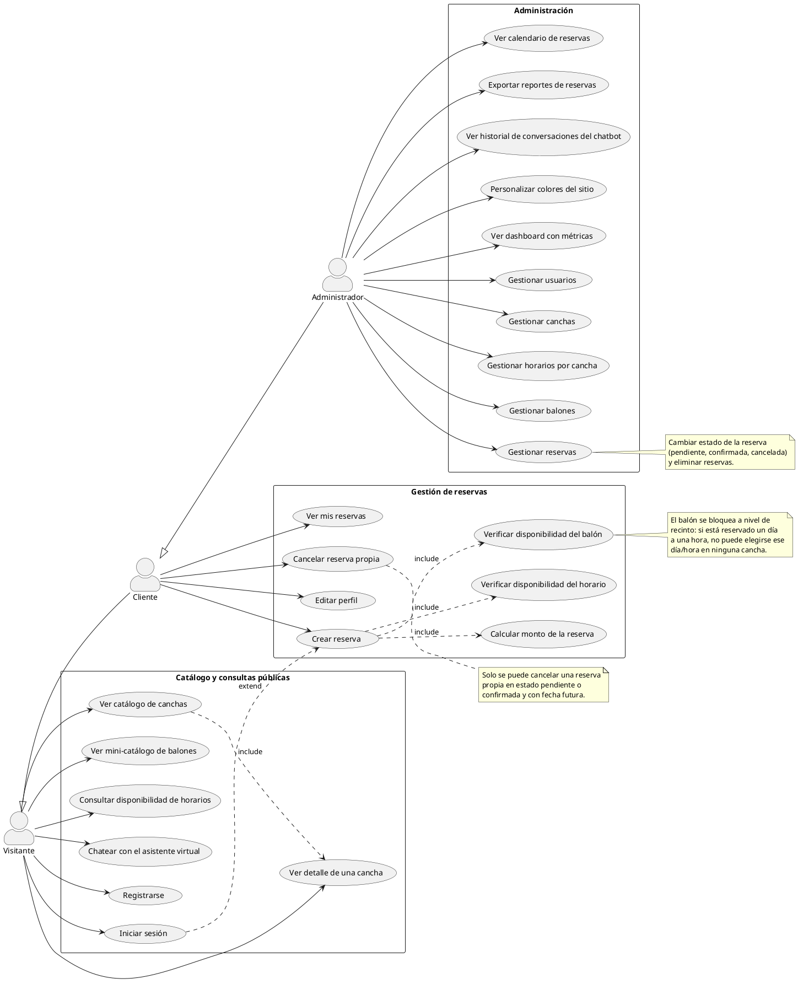

# Diagrama de casos de uso - Sistema de Reservas de Canchas Deportivas "Wally"

Diagrama de casos de uso del sistema actual. Fuente PlantUML en [casos-de-uso.puml](./casos-de-uso.puml).

```plantuml
@startuml casos-de-uso
' Diagrama de casos de uso - Sistema de Reservas de Canchas Deportivas "Wally"

left to right direction
skinparam packageStyle rectangle
skinparam actorStyle awesome
skinparam shadowing false
skinparam defaultFontName Arial

' ─────────────────────────── Actores ───────────────────────────
actor "Visitante" as Visitante
actor "Cliente" as Cliente
actor "Administrador" as Administrador

Cliente -up-|> Visitante
Administrador -up-|> Cliente

' ────────────────── Catálogo y consultas públicas ──────────────────
package "Catálogo y consultas públicas" {
    usecase "Ver catálogo de canchas" as UC_Canchas
    usecase "Ver detalle de una cancha" as UC_CanchaDetalle
    usecase "Ver mini-catálogo de balones" as UC_BalonesVer
    usecase "Consultar disponibilidad de horarios" as UC_Disponibilidad
    usecase "Chatear con el asistente virtual" as UC_Chatbot
    usecase "Registrarse" as UC_Registro
    usecase "Iniciar sesión" as UC_Login
}

' ───────────────────────── Gestión de reservas ─────────────────────────
package "Gestión de reservas" {
    usecase "Crear reserva" as UC_CrearReserva
    usecase "Verificar disponibilidad del horario" as UC_VerHorario
    usecase "Verificar disponibilidad del balón" as UC_VerBalon
    usecase "Calcular monto de la reserva" as UC_CalcularMonto
    usecase "Ver mis reservas" as UC_MisReservas
    usecase "Cancelar reserva propia" as UC_CancelarReserva
    usecase "Editar perfil" as UC_Perfil
}

' ─────────────────────────── Administración ───────────────────────────
package "Administración" {
    usecase "Ver dashboard con métricas" as UC_Dashboard
    usecase "Gestionar usuarios" as UC_Usuarios
    usecase "Gestionar canchas" as UC_AdminCanchas
    usecase "Gestionar horarios por cancha" as UC_Horarios
    usecase "Gestionar balones" as UC_AdminBalones
    usecase "Gestionar reservas" as UC_AdminReservas
    usecase "Ver calendario de reservas" as UC_Calendario
    usecase "Exportar reportes de reservas" as UC_Reportes
    usecase "Ver historial de conversaciones del chatbot" as UC_Conversaciones
    usecase "Personalizar colores del sitio" as UC_Ajustes
}

' ─────────────────────── Relaciones de los actores ───────────────────────
Visitante --> UC_Canchas
Visitante --> UC_CanchaDetalle
Visitante --> UC_BalonesVer
Visitante --> UC_Disponibilidad
Visitante --> UC_Chatbot
Visitante --> UC_Registro
Visitante --> UC_Login

Cliente --> UC_CrearReserva
Cliente --> UC_MisReservas
Cliente --> UC_CancelarReserva
Cliente --> UC_Perfil

Administrador --> UC_Dashboard
Administrador --> UC_Usuarios
Administrador --> UC_AdminCanchas
Administrador --> UC_Horarios
Administrador --> UC_AdminBalones
Administrador --> UC_AdminReservas
Administrador --> UC_Calendario
Administrador --> UC_Reportes
Administrador --> UC_Conversaciones
Administrador --> UC_Ajustes

' ─────────────────────── Include / Extend ───────────────────────
UC_CrearReserva ..> UC_VerHorario : «include»
UC_CrearReserva ..> UC_VerBalon : «include»
UC_CrearReserva ..> UC_CalcularMonto : «include»
UC_Canchas ..> UC_CanchaDetalle : «include»
UC_Login ..> UC_CrearReserva : «extend»

' ─────────────────────── Notas de reglas de negocio ───────────────────────
note right of UC_CancelarReserva
  Solo se puede cancelar una reserva
  propia en estado pendiente o
  confirmada y con fecha futura.
end note

note right of UC_VerBalon
  El balón se bloquea a nivel de
  recinto: si está reservado un día
  a una hora, no puede elegirse ese
  día/hora en ninguna cancha.
end note

note right of UC_AdminReservas
  Cambiar estado de la reserva
  (pendiente, confirmada, cancelada)
  y eliminar reservas.
end note

@enduml
```